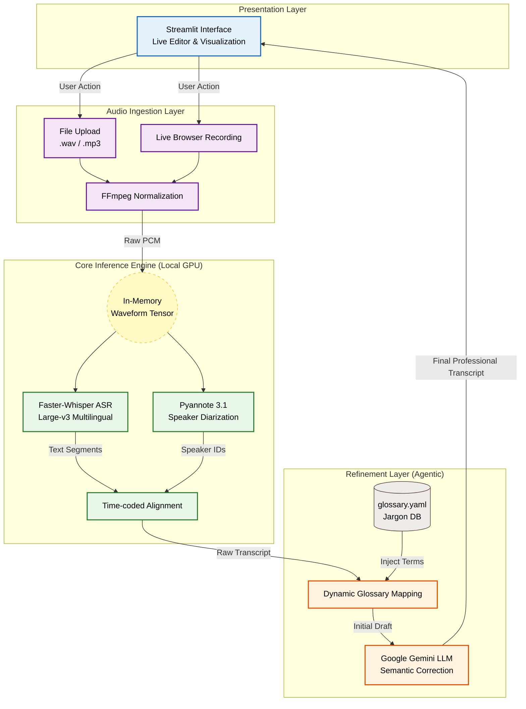

# 🤖 Agentic Omni Scriber

**Hybrid Multi-lingual Meeting Transcription System**  
*Specialized for Mandarin, English, and Taiwanese Hokkien code-switching environments.*

<p align="center">
    
    
    
     
    
           
    
    
</p>


## 🌟 Overview

Agentic Omni Scriber is an advanced meeting assistant designed to tackle the challenges of multi-lingual tech meetings in Taiwan. It combines state-of-the-art local AI models with powerful cloud-based LLMs to deliver accurate, speaker-diarized transcripts and summaries.

---

## 💎 Business Value & Strategic Impact

In the high-tech and semiconductor industries, daily communication relies heavily on "code-switching" (Mandarin-English-Taiwanese) and industry-specific jargon. **Agentic Omni Scriber** is engineered to address these unique professional challenges:

* **Accelerated Decision Making**: Automates the generation of speaker-labeled transcripts and summaries, reducing the time required for manual meeting minutes from hours to minutes.
* **Knowledge Asset Retention**: Captures and standardizes informal "black talk" (jargon) via the integrated **Glossary Editor**, turning implicit workplace knowledge into explicit digital assets.
* **Precision Communication**: Corrects phonetic errors and grammar slips in mixed-language dialogues, ensuring accuracy across cross-functional teams.
* **Privacy & Intellectual Property**: Core inference engines (`Faster-Whisper` & `Pyannote`) are designed for local deployment, satisfying the strict data security requirements (IP Protection) of the tech industry.

---

## ✨ Key Features

-   **🎙️ Flexible Input**: Support for **File Upload** (`.wav`, `.mp3`) and **Live Recording** via browser.
-   **🗣️ Speaker Diarization**: Identifies "Who said what" using `pyannote.audio`.
-   **📝 Code-Switching Expert**: Uses **Google Gemini** (or OpenAI) to correct mixed-language grammar (e.g., "Today's meeting 咱欲來討論這咧 (lán beh lâi thó-lūn tsit-ê) 蛋糕盒的spec跟size").
-   **📖 Glossary Editor**: Built-in sidebar editor to manage industry jargon (e.g., `蛋糕盒` -> `Wafer Cassette`).
-   **⚡ Agentic Processing**:
    -   **Fast Transcription**: Powered by `faster-whisper`.
    -   **Auto-Correction**: Fixes phonetic errors in Taiwanese Hokkien.
    -   **Summarization**: Generates concise meeting minutes.

---
## 📺 System Demos

**[🎥 Watch the full Web UI Demo on YouTube](https://youtu.be/qeH4zALTP_o)**


---

## 🛠️ Tech Stack

-   **Frontend**: Streamlit
-   **ASR (Transcription)**: Faster-Whisper (OpenAI Whisper)
-   **Diarization**: Pyannote.audio
-   **LLM Engine**: Google Gemini API (via `google.generativeai`)

---

## 🧠 System Architecture

The system utilizes an **Agentic Workflow** designed for high scalability, robustness, and privacy.



### Architectural Highlights:

1. **Audio Ingestion Layer**: Supports high-fidelity file uploads and real-time browser recording, with audio normalization handled via **FFmpeg**.
2. **Core Inference Engine**:
* **ASR & Diarization**: Runs `Faster-Whisper` and `Pyannote.audio` in parallel for speed.
* **In-Memory Processing**: Crucially, uses **manual waveform tensor loading** to bypass Windows environment-specific DLL conflicts (e.g., `torchcodec` issues), ensuring system robustness across different deployment environments.


3. **Refinement Layer (The Agentic Component)**:
* **Dynamic Glossary Mapping**: Performs deterministic terminology alignment based on user-defined `glossary.yaml`.
* **LLM Intelligence (Google Gemini)**: Executes semantic error correction and smooths multi-lingual transitions for professional readability.


4. **Presentation Layer**: A user-centric **Streamlit** interface featuring a live Glossary Editor and interactive transcript visualization.

---

## 📂 Project Structure

The project follows a modular architecture to separate the user interface, core processing logic, and configuration data.

```text
Agentic-Omni-Scriber/
├── app.py              # Main Streamlit application (UI & Workflow Orchestration)
├── requirements.txt    # Python dependencies
├── .env                # Environment variables for API keys (Not committed)
├── .gitignore          # Git exclusion rules
├── LICENSE             # MIT License terms
├── README.md           # Project documentation
├── config/
│   └── glossary.yaml   # Industry-specific jargon database
└── core/
    ├── __init__.py
    ├── engine.py       # ASR (Faster-Whisper) & Diarization (Pyannote) logic
    └── processor.py    # Text refinement & LLM (Gemini) orchestration

```
### File Descriptions:

* **`app.py`**: The entry point for the web-based interface. It manages user interactions, audio uploads/recordings, and coordinates the flow between the inference engine and text processor.
* **`core/engine.py`**: Encapsulates the `OmniEngine` class. It is responsible for initializing the local AI models, loading audio into memory to ensure cross-platform robustness, and performing parallel transcription and speaker identification.
* **`core/processor.py`**: Encapsulates the `TextProcessor` class. It handles post-processing tasks, including rule-based glossary mapping and agentic workflows using the Gemini API for grammatical correction and summarization.
* **`config/glossary.yaml`**: A dedicated configuration file that stores specialized terminology (e.g., semiconductor jargon). This allows for easy updates to the system's domain knowledge without modifying code.
* **`requirements.txt`**: A comprehensive list of all necessary libraries, including `faster-whisper`, `pyannote.audio`, `streamlit`, and `google-generativeai`.

---
## 🏗️ Installation

### Prerequisites
1.  **Python 3.10+** installed.
2.  **FFmpeg** installed and added to system PATH.

### Steps
1.  Clone the repository:
    ```bash
    git clone https://github.com/your-username/omni_scribe_agent.git
    cd omni_scribe_agent
    ```

2.  Create and activate a virtual environment:
    ```bash
    python -m venv .venv
    # Windows
    .venv\Scripts\activate
    # Mac/Linux
    source .venv/bin/activate
    ```

3.  Install dependencies:
    ```bash
    pip install -r requirements.txt
    ```
    *Note: On Windows, you might see `torchcodec` warnings, which this app handles gracefully.*

---

## ⚙️ Configuration

1.  Create a `.env` file in the root directory:
    ```env
    # Required for Speaker Diarization
    HF_TOKEN=your_huggingface_token

    # Required for AI Correction & Summarization
    GEMINI_API_KEY=your_google_gemini_api_key
    ```
    -   **HF_TOKEN**: Get from [Hugging Face Settings](https://huggingface.co/settings/tokens). You must accept user conditions for `pyannote/speaker-diarization-3.1`.
    -   **GEMINI_API_KEY**: Get from [Google AI Studio](https://aistudio.google.com/).

---

## 🚀 Usage

Run the Streamlit application:
```bash
streamlit run app.py
```

### Sidebar Controls
1.  **Glossary Editor**: Add your company's "Black Talk" (Jargon) here.
2.  **System Config**: Verify your HF Token.
3.  **LLM Post-Processing**: Select the latest Gemini model (e.g., `gemini-2.0-flash-exp`).

---

## 🤝 Contributing

Pull requests are welcome. For major changes, please open an issue first to discuss what you would like to change.
